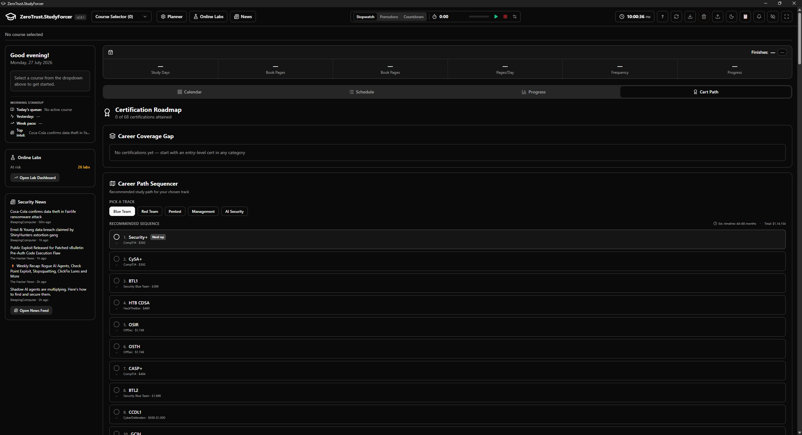

<p align="center">
  
</p>

<h1 align="center">ZeroTrust.StudyForcer</h1>

<p align="center">
  <b>Zero Trust in your ability to pass. Prove us wrong.</b><br>
  A cybersecurity certification study tracker — one plan at a time, no fluff.
</p>

<p align="center">
  
  
  
</p>

<p align="center">
  
</p>

Runs as a portable desktop app (recommended) or locally in your browser. Built with [Tauri 2](https://v2.tauri.app) + React + TypeScript + Rust.

---

## Highlights

- **Plans that adapt to reality** — log what you actually read; the schedule recomputes around your real pace
- **Holds you accountable** — streaks, sprint boosts, an adversary mode that punishes missed deadlines
- **Knows the cert landscape** — 68 certifications across 5 career tracks, with gap analysis and exam countdowns
- **Security-flavoured extras** — built-in news feed, CVE-of-the-day, lab session tracking, OPSEC mode for screen sharing

## Features

### Planning & Tracking

| Feature | What it does |
|---------|--------------|
| Schedule engine | Set pages/day, study days, start date → day-by-day plan |
| Multi-course | Track CISSP, SecAI+, OSCP side by side on a merged calendar |
| Per-plan logging | Log pages read or skip a day; each plan tracked independently |
| Mark Done | One-click commit point; schedule recomputes around your real pace |
| Progress dashboard | % done, pages consumed vs planned, per-unit breakdown, domain weakness analysis |
| Study timer | Pomodoro / stopwatch / countdown with auto-log |
| Streak counter | Consecutive-day study streak in the header |
| Auto-backup | Daily snapshot of all plans (keeps last 10) |
| Report generator | Export progress as CSV, JSON, or PDF |
| Temp log persistence | In-progress Log/Skip state survives restarts |

### Accountability

| Feature | What it does |
|---------|--------------|
| Sprint mode | Temporary pace boost overlay; auto-expires when the sprint ends |
| Adversary timer | Miss your daily deadline → tomorrow's pace auto-bumps (opt-in) |
| Postmortem mode | Exam date passed? Write a 5-section postmortem |
| Exam-day alert | Color-coded urgency banner when your exam is T-3 or less |
| Morning standup | 4-line incident report: today's queue, yesterday's progress, week pace, top headline |

### Career Intelligence

| Feature | What it does |
|---------|--------------|
| Certification roadmap | 68 certs across 5 tracks (Blue Team, Red Team, Pentest, Management, AI Security) |
| Gap analysis | Auto-detects progress from your study plans |
| Career mode | Sequencer that orders your next certs |
| Compliance report | Exportable coverage report |
| CVE-of-the-day | Freshest vulnerability from your news feed, pinned with a red badge |

### Extras

| Feature | What it does |
|---------|--------------|
| Personality modes | 13 text themes — Drill Sergeant, Cyberpunk, Passive-Aggressive Mom, and 10 more |
| OPSEC mode | Mask course names, plan names, and page counts for screen sharing |
| Online labs | Track lab sessions, streaks, at-risk alerts; optionally credit time to exam domains |
| Security news | Built-in RSS/Atom feed reader |
| Course builder | Create custom course configs with live JSON preview and validation |
| Native notifications | Daily reminder at your chosen time, even in the background (desktop only) |
| Accessibility | WCAG-AA: skip link, focus traps, keyboard shortcuts (`?` for cheatsheet), screen-reader landmarks |

## Quick Start

| Platform | How to run |
|----------|-----------|
| **Desktop** | Download `ZTSFvX.X.X.exe` from [Releases](https://github.com/Ganron007/ZeroTrust-StudyForcer/releases) and double-click — no install required |
| **Browser** | `npm install && npm run dev` → opens at `http://localhost:5173` |

> **Note:** In browser mode the news feed is unavailable (needs the Tauri backend). Everything else works via localStorage.

## Creating Your Own Course

1. Open **Planner** → **Build Course**
2. Add units, chapters, and page counts (drag to reorder)
3. Click **Save Course to Library** — it appears in the course selector immediately
4. Use **Export JSON** to share or back up a course

## Build from Source

```sh
npm install
npm run tauri:dev        # Dev shell (hot-reload)
npm run tauri:build:all  # Production EXE (portable build)
npm run build            # Type-check + Vite build only (no Tauri)
```

The frontend is plain Vite — `npm run dev` works in a browser, but anything touching file-backed Tauri commands requires the desktop shell.

## Project Layout

```
src/                        React + TypeScript frontend
  components/               UI (calendar, schedule, planner, dashboards, banners)
  hooks/                    useStudyLogging, useSchedule, useKeyboardShortcuts, ...
  lib/                      Schedule engine, storage (SQLite + localStorage), personality
src-tauri/                  Rust backend (FS I/O, RSS fetcher, tray, window state)
public/default-course.json  Seeded on first launch
Docs/Arch/                  Deep architecture series (01 overview → 07 testing)
```

Plans live in SQLite; labs, timer state, news, and window position are JSON files under `<appData>/studyplanner.app/data/`.

## Documentation

| File | What it covers |
|------|---------------|
| [`ARCHITECTURE.md`](ARCHITECTURE.md) | Design decisions and inviolable rules |
| [`Docs/Arch/`](Docs/Arch/) | Deep architecture series with diagrams |
| [`CHANGELOG.md`](CHANGELOG.md) | Version history |
| [`How_to_read.md`](How_to_read.md) | Doc index with reading paths |

## Security Notes

- Course logos are user-supplied SVGs, sanitized via an allow-list parser before rendering
- Strict CSP configured in `src-tauri/tauri.conf.json`
- Window resize/move writes to disk are throttled

## License

MIT — see [LICENSE](LICENSE).
